# Phase 2 — Threat Intelligence Enrichment & OWASP Abuse Detection

## Overview
Phase 2 expands the SOC Lab’s capability by integrating threat intelligence enrichment and detecting OWASP Top 10 abuses. This includes developing a Python enrichment pipeline, securing APIs with JWT, simulating broken authentication and brute-force scenarios, and validating coverage using Zeek and Arkime.

Phase 2.5 focuses on hardened API misuse simulations with ZAP, enforcing security controls like rate-limiting, revoked token checks, and insecure direct object reference (BOLA) detection.

## Objectives
- Build a threat enrichment engine using VirusTotal, AbuseIPDB, and OTX APIs
- Tag Zeek/Suricata logs with malicious IP metadata
- Harden API security with JWT-based auth, token revocation, and input validation
- Simulate OWASP attacks (e.g. SQLi, brute force, BOLA, broken auth) using ZAP
- Detect abuse via Zeek custom scripts and log inspection
- Validate visibility through Arkime, Elasticsearch, and backend logs

## 🧰 Technologies Used
- Python (threat enrichment logic)
- Flask + JWT (secure API development)
- OWASP ZAP (automated API security testing)
- Zeek & Suricata (detection engines)
- Arkime (PCAP session tagging & exploration)
- Elasticsearch (IOC metadata indexing)
- SQLite (IOC cache storage)

## 🕵️ Detection Map

| Abuse Case            | Tool Detected With         | Location/File                       |
|-----------------------|----------------------------|-------------------------------------|
| SQL Injection         | Suricata, Arkime SPIView   | `sqli_suricata.png`                 |
| Brute Force Login     | Zeek                       | `brute_force_zeek.png`              |
| Bad Username Attempt  | Arkime, Zeek HTTP logs     | `arkime_api_hardened.png`           |
| Suspicious HTTP Verb  | Zeek                       | `zeek_suspicious_verb.png`          |
| Unauthorized POST     | Zeek                       | `zeek_api_hardened.png`             |
| BOLA Exposure         | ZAP + Manual Verification  | `zap_api_hardened.png`              |

## Repo Structure
- `enrich.py` — Python enrichment pipeline for threat intel APIs
- `app.py` — Hardened Flask API with JWT-based auth and abuse endpoints
- `zap_scan.sh` — Automated ZAP scan invoking abuse cases
- `logs/` — Captured logs from API runs and scans
- `custom_detections/` — Zeek scripts for sqli, reverse shells, beaconing, brute force
- `screenshots/` — Arkime session views and detection proof
- `README.md` — This documentation file

## 📸 Screenshots

Below are selected screenshots demonstrating abuse detection and enrichment visibility:
- **Figure 1** — Threat Enrichment Terminal Output
  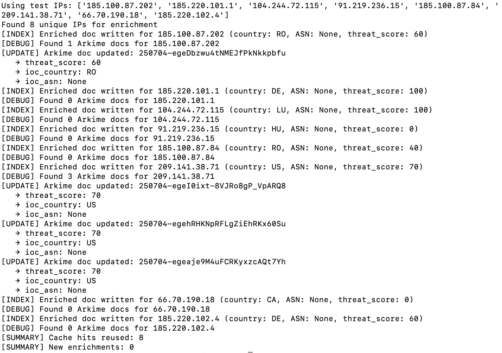

- **Figure 2** — Threat Intel Elasticsearch Output   
  

- **Figure 3** — Virus Total Reference  
  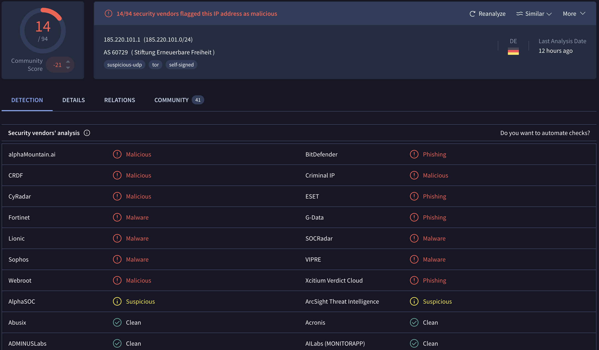

- **Figure 4** — Arkime Tagged Session
  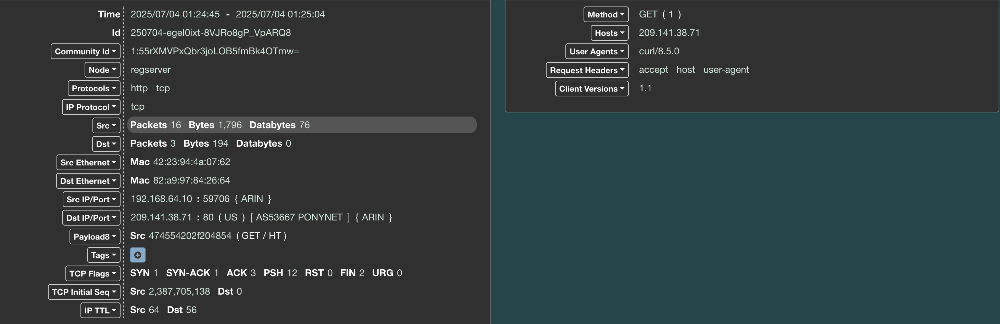

- **Figure 5** — IOC Threat Summary Table  
  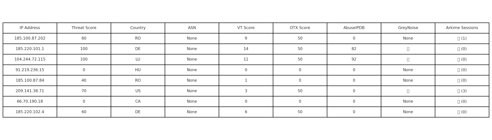

- **Figure 6** — Zap Scan Results 
  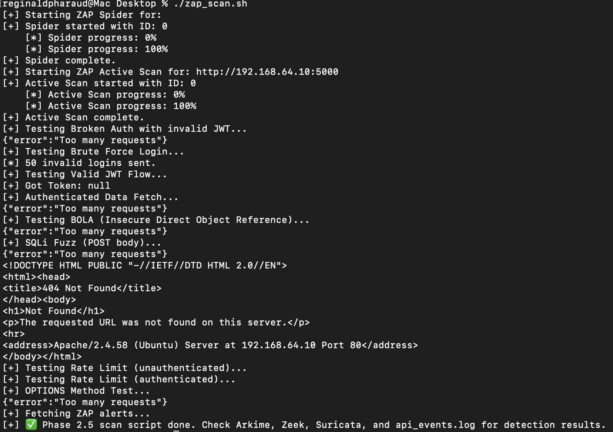

- **Figure 7** — Zap Scan Results Hardened   
  

- **Figure 8** — HTTP Conn Log Zeek Hardened  
  

- **Figure 9** — Login Abuse Suricata Hardened  
  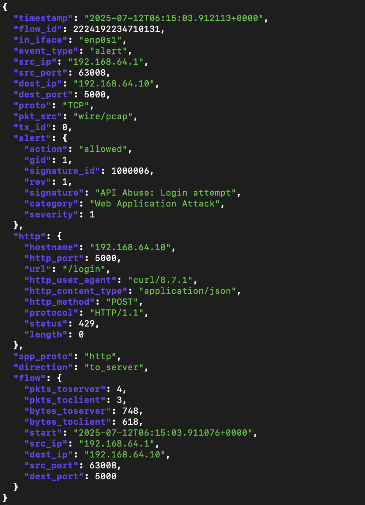

- **Figure 10** — Bad Username Detection via Arkime  
  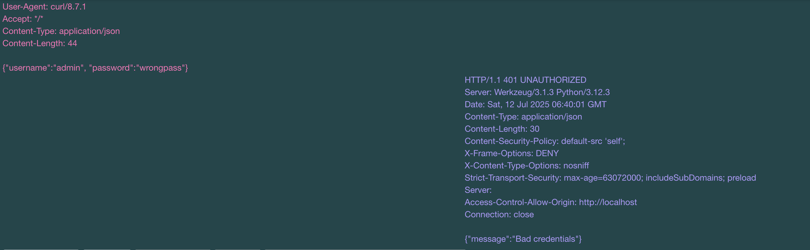

- **Figure 11** — Potential Brute Force Detected (Zeek)  
  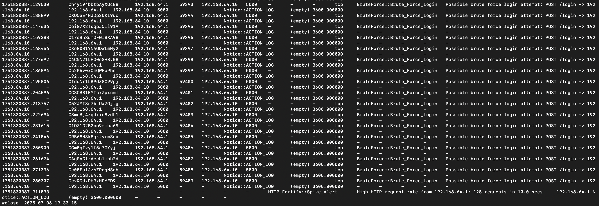

- **Figure 12** — Potential SQLi Detected (Suricata)  
  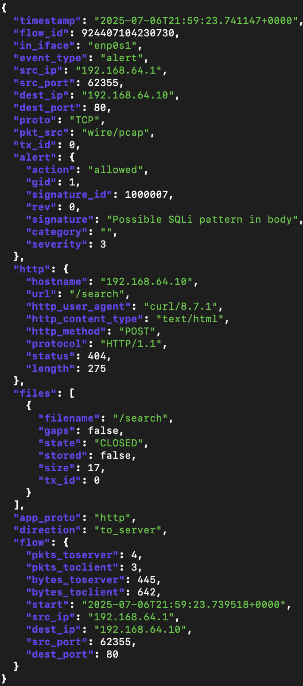

- **Figure 13** — Potential SQLi Detected (Arkime SPIView)  
  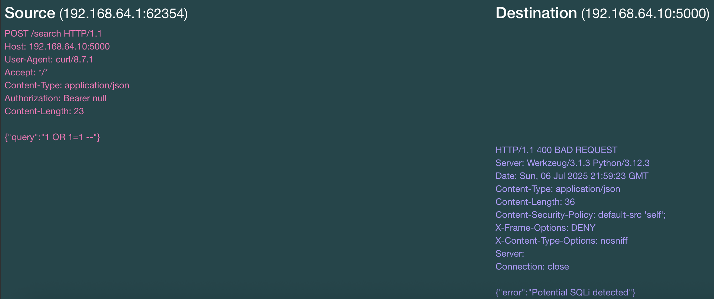

- **Figure 14** — API Endpoint Exposure via ZAP  
  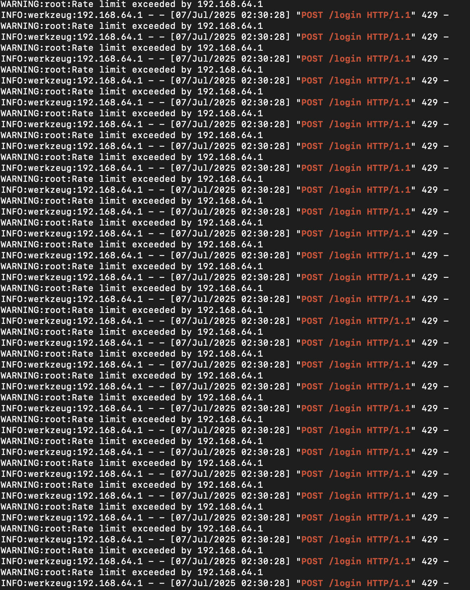

- **Figure 15** - Unauthorized HTTP POST (Zeek Suspicious Verb)
  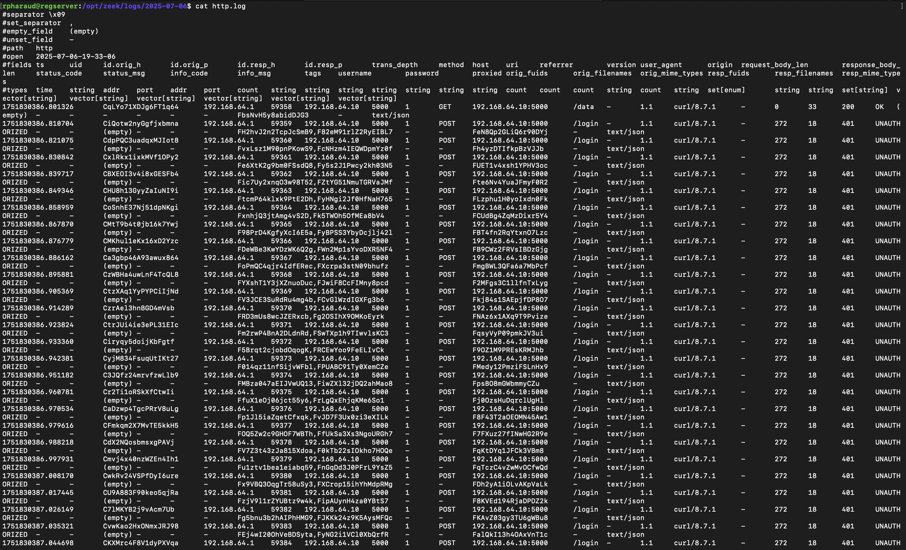

## Next Steps
Transition to Phase 3: **Automated Alerting & Correlation** where detection signals from Zeek, Suricata, and enriched logs will be combined to produce actionable alerts and event trails.

