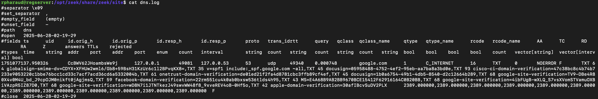
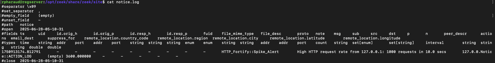
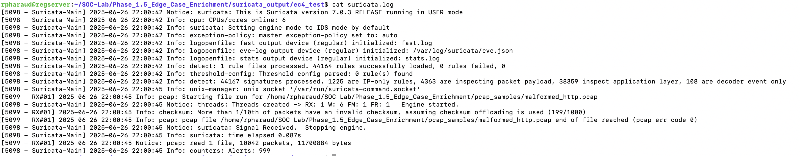
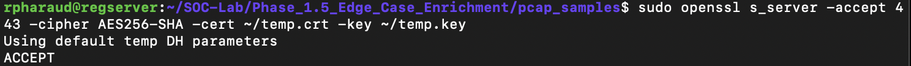
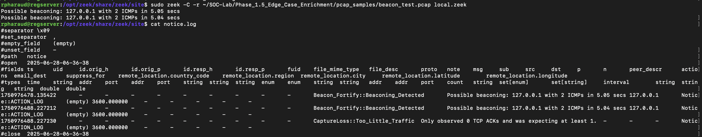
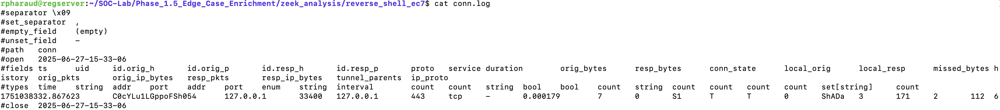
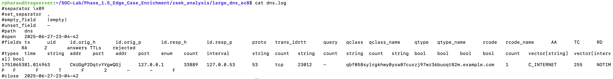
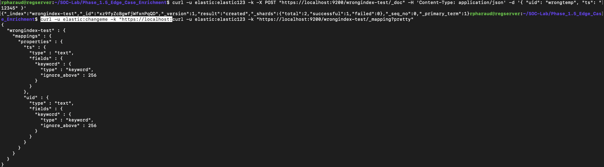
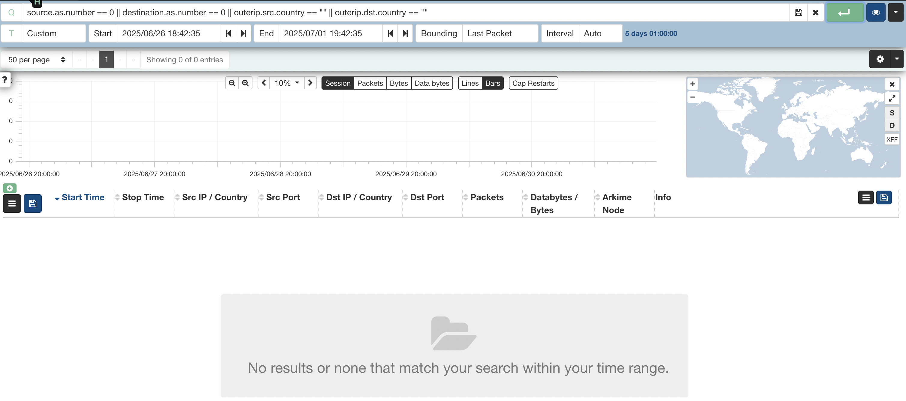
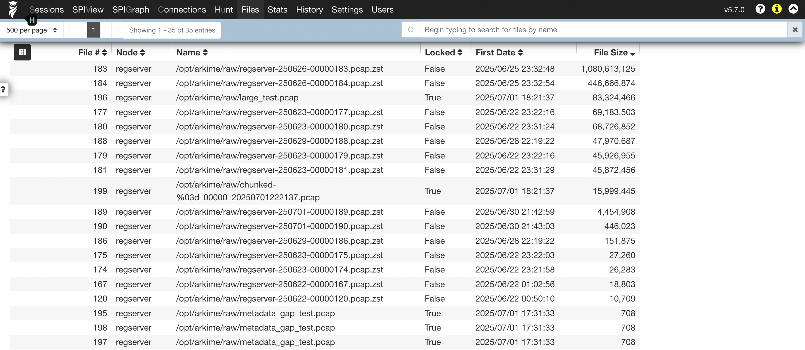

# Phase 1.5 — Edge Case Detection & Log Enrichment

## Overview
Phase 1.5 extends the SOC Lab by validating detection coverage for edge cases, ensuring robust pipelines for real-world scenarios. This phase includes custom Zeek and Suricata configurations, Arkime ingestion validation, and parser tuning using Logstash and Filebeat.

## Objectives
- Design and test edge cases (extreme values, boundary conditions, malformed logs)
- Tune detection pipelines to handle edge conditions gracefully
- Validate ingestion pipelines with Arkime, Elasticsearch, and Logstash
- Document runbooks, commands, and acronyms for repeatability

## Repo Structure
- `edge_cases/` — Table of all edge cases tested
- `configs/` — Custom Suricata rules, Zeek scripts, Logstash pipelines, Filebeat config
- `logs/` — Sample test logs and malformed JSON examples
- `screenshots/` — Proof of ingestion, Arkime session view, Zeek & Suricata output
- `appendix/` — Commands used, acronyms list

## 📸 Screenshots

Below are selected screenshots demonstrating detection coverage and edge case validation:

- **Figure 1** — Zeek DNS log Detection  
  

- **Figure 2** — Zeek SSH log Detection  
  

- **Figure 3** — HTTP log Spike Alert  
  

- **Figure 4** — Suricata Eve JSON log  
  

- **Figure 5** — SSL log Weak Cipher  
  

- **Figure 6** — Zeek Conn log Beacon Detection  
  

- **Figure 7** — Zeek Conn log Reverse Shell  
  

- **Figure 8** — Zeek DNS log Large TXT Record  
  

- **Figure 9** — Elasticsearch Indices for Various Edge Cases  
  

- **Figure 10** — Elasticsearch Index Template Mismatch  
  

- **Figure 11** — Arkime SPIView Missing GEO/ASN Metadata  
  

- **Figure 12** — Evidence of Large PCAP for Stress Test  
  

- **Figure 13** — Arkime SPIView Fields with No GEO for Private IP  
  

## Next Steps
Transition to Phase 2: Threat Intelligence Enrichment Pipeline and Phase 3: Automated Alerting & Correlation.
