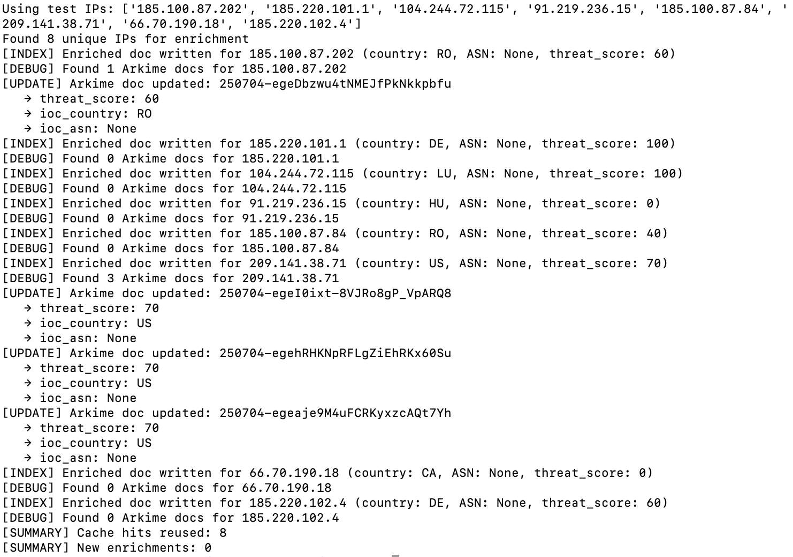
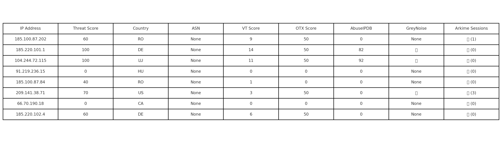

# Phase 2 — Threat Intelligence Enrichment & OWASP Abuse Detection

## Overview
Phase 2 significantly expands the SOC Lab’s capability by integrating **threat intelligence enrichment** and **OWASP Top 10 abuse detection**.  
This includes:
- Developing a Python-based enrichment pipeline
- Securing APIs with JWT
- Simulating broken authentication and brute-force scenarios
- Validating detection coverage using Zeek, Suricata, and Arkime

---

## Phase 2.5 — Hardened API Abuse Simulation
Phase 2.5 extends these capabilities by focusing on **hardened API misuse simulations** using OWASP ZAP and enforcing additional **security controls**:
- **Rate-limiting** and brute-force mitigation
- **Revoked token checks**
- **Insecure Direct Object Reference (BOLA)** detection
- **Hardened authentication & input validation**
- Additional detection rules in Zeek and Suricata

---

## Phase 2.7 — OSINT Enrichment Expansion
Phase 2.7 introduces a **major upgrade** to the enrichment pipeline with:
- **`enrich_v2.py`** — a fully re-architected enrichment pipeline
- **`update_scamsniffer_blacklist.py`** — Web3 blacklist updater for scam domain detection

### enrich_v2.py
**Description:**  
A redesigned enrichment pipeline improving **OSINT coverage**, **scoring accuracy**, and **Web3 abuse visibility**.

**Key Features:**
- **Expanded OSINT Sources:**
  - Passive DNS via OTX and custom parsers
  - WHOIS domain age + registrar analysis
  - GeoIP + ASN fallback with bogon/reserved range tagging
  - SSL certificate anomaly detection
  - Web3 abuse intelligence (ENS domains, ScamSniffer lookups)
- **Refined Scoring Logic:**
  - Separate **Threat**, **Context**, and **OSINT** scoring
  - Tiered dictionary weighting for precision
- **Data Outputs:**
  - Arkime session tagging
  - JSON / NDJSON export for downstream analysis
- **Modes of Operation:**
  - Test, Live, and Hybrid modes
- **Error Handling:**
  - Graceful fallback when APIs fail or data is missing

---

### update_scamsniffer_blacklist.py
**Description:**  
Fetches and maintains the **ScamSniffer malicious domain blacklist** for offline Web3 threat lookups.

**Key Features:**
- Pulls latest ScamSniffer JSON blacklist
- Saves locally for offline lookups by `enrich_v2.py`
- Enables periodic updates for blacklist freshness

---

### Workflow Integration
1. **Run `update_scamsniffer_blacklist.py`**  
   Pulls the latest ScamSniffer blacklist for offline enrichment use.
   
2. **Run `enrich_v2.py`**  
   Performs OSINT enrichment, scoring, and Web3 detection.

---

## Objectives
- Build and expand a threat enrichment engine using VirusTotal, AbuseIPDB, OTX, and Web3 sources
- Tag Zeek/Suricata logs with malicious IOC metadata
- Harden API security with JWT-based authentication, revocation checks, and input validation
- Simulate OWASP attacks (SQLi, brute force, BOLA, broken auth) using ZAP
- Detect abuse via custom Zeek scripts and log inspection
- Validate visibility in Arkime, Elasticsearch, and backend logs

---

## 🧰 Technologies Used
- **Python** — enrichment logic, automation scripts
- **Flask + JWT** — secure API endpoints
- **OWASP ZAP** — automated abuse simulation
- **Zeek & Suricata** — detection engines
- **Arkime** — deep packet capture & IOC tagging
- **Elasticsearch** — IOC metadata indexing
- **SQLite** — IOC caching

---

## 🕵️ Detection Map

| Abuse Case            | Tool Detected With         | Location/File                       |
|-----------------------|----------------------------|-------------------------------------|
| SQL Injection         | Suricata, Arkime SPIView   | `sqli_suricata.png`                 |
| Brute Force Login     | Zeek                       | `brute_force_zeek.png`              |
| Bad Username Attempt  | Arkime, Zeek HTTP logs     | `arkime_api_hardened.png`           |
| Suspicious HTTP Verb  | Zeek                       | `zeek_suspicious_verb.png`          |
| Unauthorized POST     | Zeek                       | `zeek_api_hardened.png`             |
| BOLA Exposure         | ZAP + Manual Verification  | `zap_api_hardened.png`              |

---

## 📂 Repo Structure
- `enrich.py` — Original enrichment pipeline
- `enrich_v2.py` — New OSINT/Web3 enrichment engine
- `update_scamsniffer_blacklist.py` — ScamSniffer updater
- `app.py` — Hardened API service with abuse endpoints
- `zap_scan.sh` — Automated OWASP abuse simulation
- `logs/` — Captured abuse and enrichment logs
- `custom_detections/` — Zeek detection scripts
- `screenshots/` — Visual detection evidence
- `README.md` — Documentation

---

## 📸 Screenshots
- **Threat Enrichment Terminal Output**  
  

- **Threat Intel Elasticsearch Output**  
  

- **VirusTotal Reference**  
  

- **Arkime Tagged Session**  
  

- **IOC Threat Summary Table**  
  

- **Zap Scan Hardened**  
  

- **Brute Force Detection (Zeek)**  
  

- **SQLi Detection (Suricata)**  
  

- **SQLi Detection (Arkime)**  
  

---

## Next Steps
Transition to **Phase 3 — Automated Alerting & Correlation**, combining enriched threat data from Zeek, Suricata, and Arkime into actionable alerts for SOC analysts.
